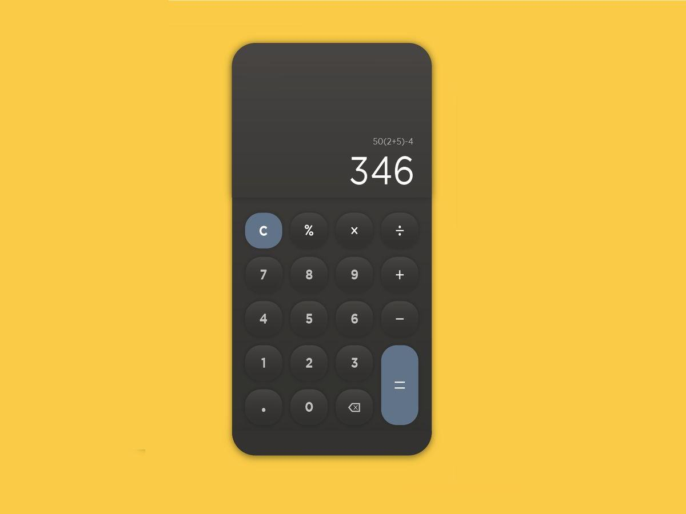

# 🧮 Calculadora

Calculadora simple construida con **HTML**, **CSS** y **JavaScript**.


---

## ✨ Características principales

- Operaciones básicas: suma, resta, multiplicación y división
- Actualización en pantalla en tiempo real
- Botón de igual y botón de reset
- Diseño responsive y minimalista
- Lógica clara y separada del diseño

---

## 📸 Vista previa



---

## ⚙️ Tecnologías utilizadas

- HTML
- CSS
- JavaScript Vanilla

---

## 🚀 Cómo correr el proyecto localmente

```bash
git clone https://github.com/Nicolas-Eliazer-Jara/Calculator-javaScript
cd calculadora
abre el archivo index.html en tu navegador

---

📄 Licencia
Este proyecto es de uso personal. Si querés reutilizar alguna parte, por favor citá el repositorio o consultame antes.

---

✉️ Contacto
Si te interesa mi trabajo o querés contactarme:

📧 nicolas.jara.dev@gmail.com

🌐 Tu sitio desplegado en Vercel